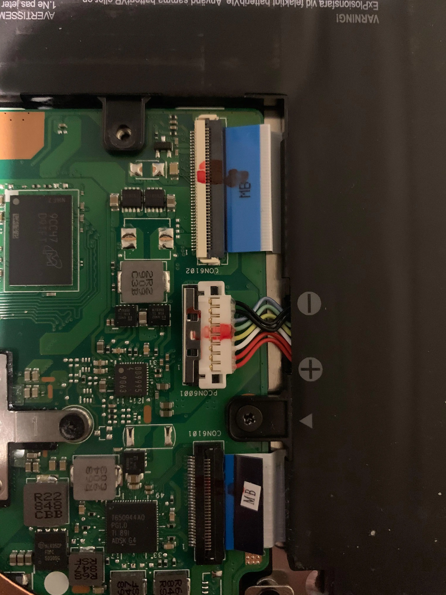

I bought a Chromebook a couple of years ago to do school work on — it only cost about £100 and was very small and light, perfect for carrying around school. At the time I had never experienced Linux and was fine with storing all my stuff on Google Docs/drive etc.

Last year I switched to Linux on my main laptop (one that's too large to use for school), and since then I've always wanted to be able to install it on my Chromebook. Unfortunately that's not easy — Chromebooks use a lot of obscure hardware for which drivers are only implemented in Chrome OS and not upstream Linux. Google also licenses Chromebook manufacturing and some parts of design to other manufactures, meaning that each Chromebook can be very different, and as such there is no single guide to install Linux on a Chromebook.

My particular Chromebook is an Asus c223n with an Apollolake processor. Here are the steps I took to install Arch Linux:

1. [Enable developer mode](https://www.howtogeek.com/210817/how-to-enable-developer-mode-on-your-chromebook/). This will result in a warning screen showing every time you boot up your computer - just press Control+D at this screen to boot Chrome OS as normal, or press Control+L for the SeaBIOS menu (for booting to a USB or other install).

2. In ApolloLake the firmware read/write protection is active when the battery is plugged in (as opposed to a screw being present in other Chromebooks). To disable this open up the back of the Laptop and disconnect the battery from the motherboard (connected via 8 multicoloured wires). This is done by pulling the metallic holder off the top of the white cable head, then pulling the cable head up and out of the socket. I just folded the wires back so that the cable head was in between the bottom of the battery and the laptop case. This will of course mean you will need a stable power connection during the rest of the installation.



3. Boot using the power cable as the power source and open Chrome. Press Control+Alt+T to open crosh and use the `shell` command to open a shell. Use [Mr Chromebox's script](https://mrchromebox.tech/#fwscript) to install RW_LEGACY firmware.

4. Turn the Chromebook off and plug in a bootable USB containing the Arch Installation ISO.

5. Turn the Chromebook on and press Control+L at the developer mode boot screen to use the alternate boot menu. Follow the steps to boot from the USB.

6. Connect to Wi-Fi (`ip link set wlan0 up`, `iwctl --passphrase PASSPHRASE station wlan0 connect SSID`, `dhcpcd wlan0`).

7. Partition the disk to look something like below (partitions have been sorted by layout which they weren't previously, and partitions 1-5 were originally on the chromebook and I have kept them):
```
Device            Start      End  Sectors  Size Type
/dev/mmcblk1p1       64    16447    16384    8M unknown
/dev/mmcblk1p2    16448    16448        1  512B ChromeOS kernel
/dev/mmcblk1p3    16449    16449        1  512B ChromeOS root fs
/dev/mmcblk1p4    16450    16450        1  512B ChromeOS reserved
/dev/mmcblk1p5    16451    16451        1  512B ChromeOS reserved
/dev/mmcblk1p6    18432  1363967  1345536  657M EFI System
/dev/mmcblk1p11 1363968  9752575  8388608    4G Linux swap
/dev/mmcblk1p12 9752576 61071326 51318751 24.5G Linux root (x86-64)
```
Also make sure to format the root and boot partition as well as enabling the swap partition.

8. Follow official installation instructions until Boot Loader section, where I followed [the Syslinux installation instructions](https://wiki.archlinux.org/index.php/Syslinux).

9. Reboot and everything should work fine! (Remember to press Control+L at the developer boot warning screen).

The Syslinux + SeaBIOS combination creates a slightly weird boot process. First the BIOS shows a developer mode warning, then SeaBIOS loads Syslinux, then Syslinux loads Linux, then Linux loads my login manager. A lot of steps that can go wrong - but it works for now.
[Boot process](https://www.youtube.com/watch?v=wbdMpEMTalw).

## Suspend

Apparently on Apollo Lake processors using suspend can cause the BIOS to enter a recovery mode (which may prevent booting into Linux?). Apparently this might have been fixed in recent kernels, but I am not sure. Personally I haven't had a need to use suspend yet.

## Audio

Audio sadly doesn't work on the chromebook. I did find [this blog post](https://bkhome.org/news/201912/sound-fix-for-54-kernel-on-apollo-lake.html) which looks to be the same problem but the solution didn't work for me - maybe it will for you. Also, apparently [this modified 4.4 kernel](https://gitlab.com/moussaelianarsen/chromebook-linux-audio/-/tree/master/) works, but I do not want to go to that much effort.
